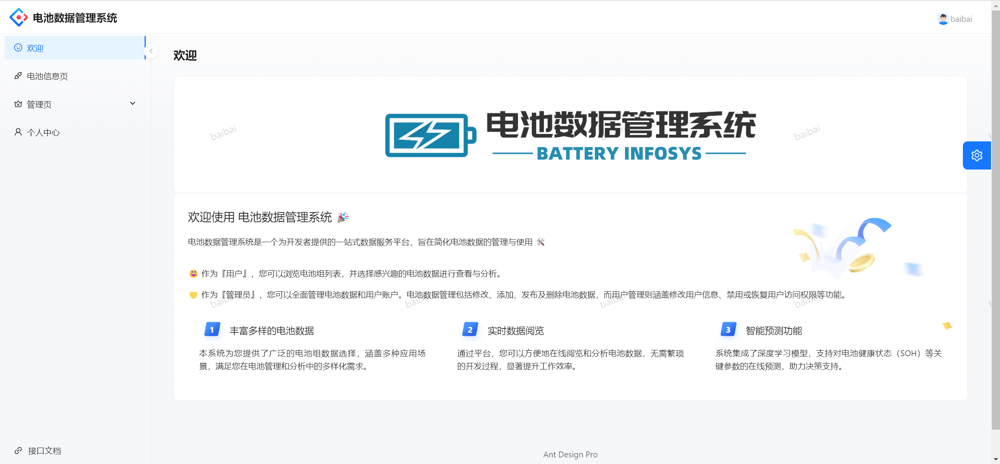
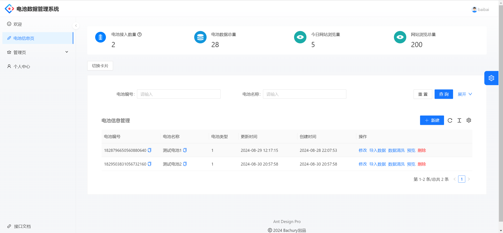
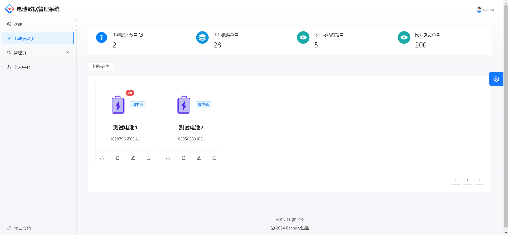
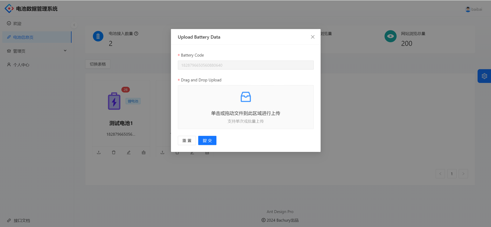
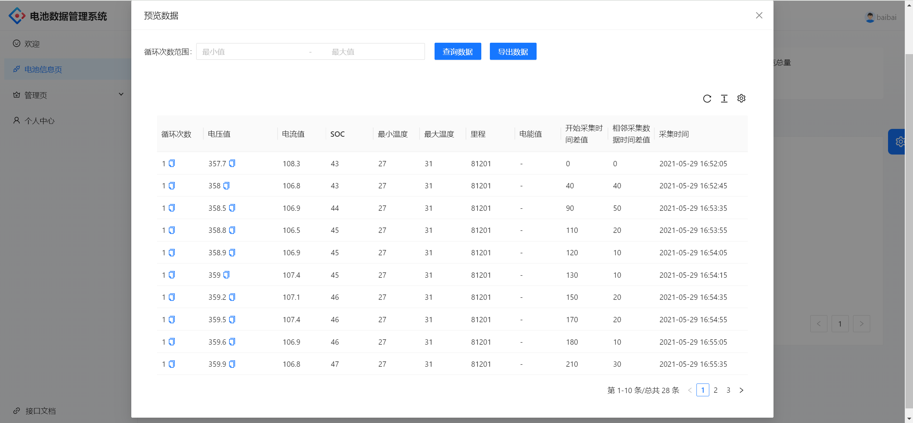
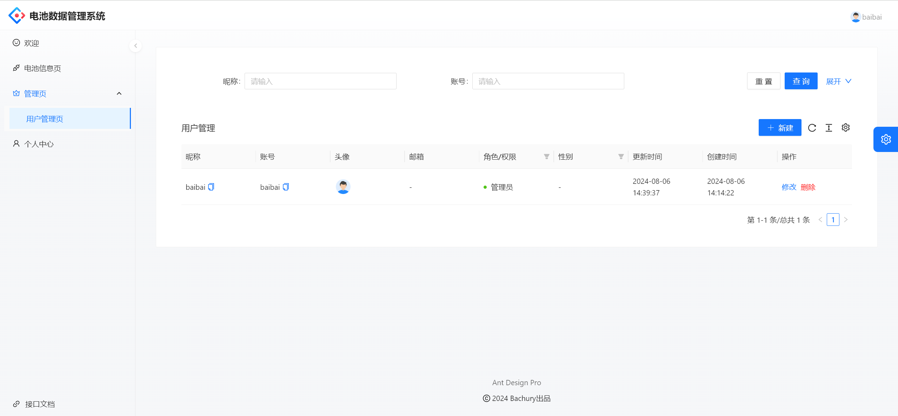
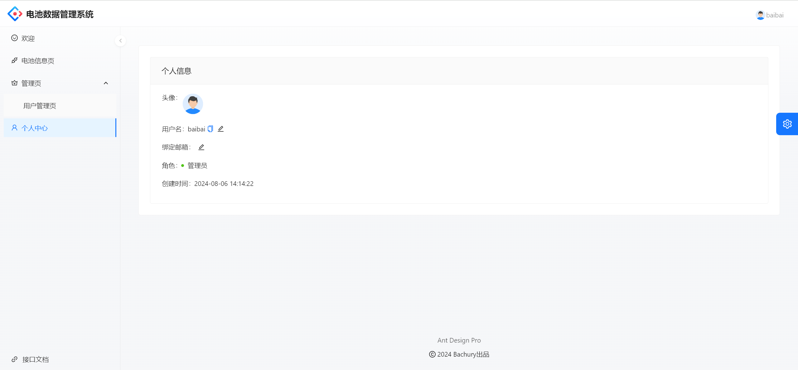
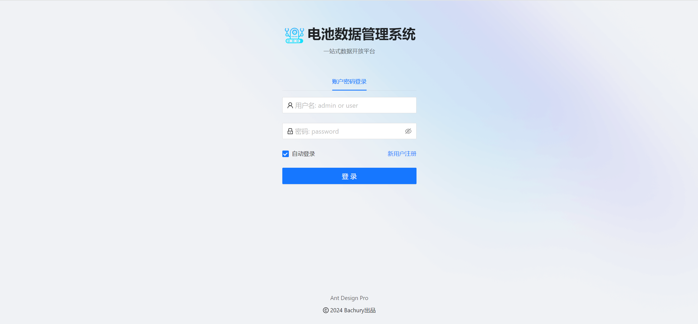

    

<h1 align="center">电池数据管理系统</h1>

<strong>一站式数据管理平台 🛠</strong>

    

    

## 项目简介🗺️

电池数据管理系统是一个为开发者提供的一站式数据服务平台，旨在简化电池数据的管理与使用 🛠

😀 作为『用户』，您可以浏览电池组列表，并选择感兴趣的电池数据进行查看与分析。

🤝 作为『管理员』，您可以全面管理电池数据和用户账户。电池数据管理包括修改、添加、发布及删除电池数据，而用户管理则涵盖修改用户信息、禁用或恢复用户访问权限等功能。

## 目录结构 📑

| 模块                        | 模块说明     |
| --------------------------- | ------------ |
| 🏘️user-center-backend-master | 后端服务模块 |
| 🏘️battery-frontend-master    | 前端界面     |

## 技术选型 🎯

## 后端

- SpringBoot
- Maven
- MySQL
- Lombok
- Junit
- Mybatis-plus
- Hutool

## 前端

- Ant Design Pro Umi
- AntV
- React
- Umi
- axios
- VuePress
- Hexo

## 功能展示🎯

### 欢迎页面

### 电池管理

### 数据上传

### 数据预览

### 用户管理

### 系统登录

